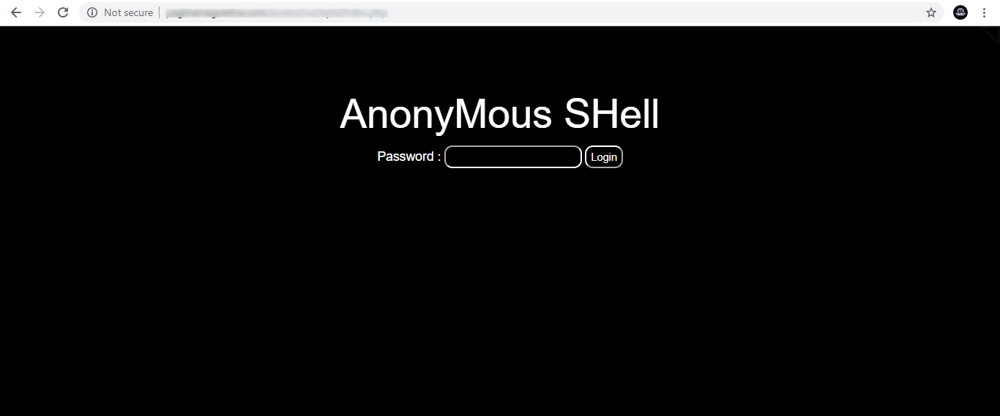
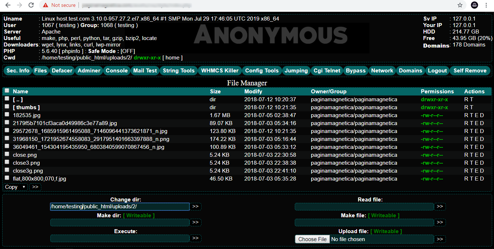

  # AnonyMous Shell v2
  
  # Tools
- [x] **All Server Bypass Shell**
- [x] **Password login protection**
- [x] **php 7.x supported**
- [x] **Console**
- [x] **Mail test**
- [x] **Adminer**
- [x] **WHMCS Killer (new)**
- [x] **Configs grabber + configs 404 + symlink config**
- [x] **Jumping (fixed)**
- [x] **Cgi telnet with new design**
- [x] **Mass defacer**
- [x] **Server domains viewer**
- [x] **Bypass disabled functions**
- [x] **Back connect**

- [x] **More useful features...**

 ______________
 __Password: hacker0882__
 ______________
 
### SCREENSHOT
</img> </img>
